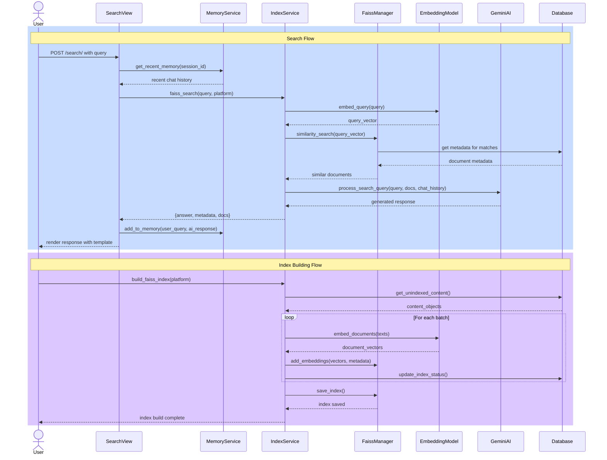
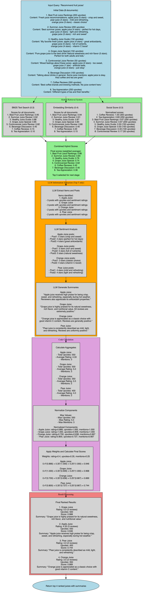

# NextGen-AI 项目

## UI 设计与流程图
- [Figma 设计链接](https://www.figma.com/design/1BZN661uSi2y4FKDcd4RgZ/NextGen-AI-(Prototype)?node-id=0-1&m=dev) (开发模式)

## 1. 环境搭建

### 1.1 创建虚拟环境
```bash
python3 -m venv venv
```

### 1.2 激活虚拟环境
```bash
# macOS/Linux
source venv/bin/activate

# Windows
venv\Scripts\activate
# 或
venv\Scripts\Activate.ps1  # PowerShell
```

### 1.3 安装项目依赖
```bash
pip install -r requirements.txt
```

## 2. 配置 Gemini API Key

```bash
python set_api_key.py  # 输入你的 API Key
```
然后重启终端并重新激活虚拟环境。

## 3. 初始化 FAISS 索引

在使用搜索功能之前，必须先初始化 FAISS 索引：

```bash
# 初始化所有平台的索引
python manage.py initialize_index --source=all

# 或者初始化特定平台的索引
python manage.py initialize_index --source=reddit
python manage.py initialize_index --source=stackoverflow
python manage.py initialize_index --source=rednote
```

初始化后，将数据库内容添加到索引中：

```bash
python manage.py index_content --source=all
```

> **注意**：每次添加新内容到数据库后，都需要运行 `index_content` 命令来更新索引。

## 4. 测试与数据准备

### 4.1 安装测试依赖
```bash
pip install faker  # 用于生成随机测试数据
```

### 4.2 运行测试
```bash
python manage.py test_rag
```

此命令会执行：
- 清空数据库
- 生成测试数据(包括 Library A/B, Reddit 内容等)
- 构建 Embeddings 并写入数据库
- 建立 FAISS 索引
- 执行一系列测试查询

## 5. 数据库迁移

当修改模型结构时，需要进行数据库迁移：

```bash
# 1. 生成迁移文件
python manage.py makemigrations

# 2. 应用迁移到数据库
python manage.py migrate

# 3. 检查迁移状态
python manage.py showmigrations
```

## 6. 爬虫模式

爬虫系统支持两种工作模式：

### 6.1 即时索引模式
- 爬取内容的同时立即进行向量化和索引
- 索引完成后自动清除数据库中的原文内容以节省存储空间
- 适用于需要立即搜索新内容的场景

```bash
python manage.py test_rednote_crawler --url "your_url" --immediate-indexing
```

### 6.2 存储模式 (默认)
- 仅将爬取的内容存入数据库，不进行索引
- 适用于批量数据收集，稍后统一索引的场景

```bash
python manage.py test_rednote_crawler --url "your_url"
```

### 6.3 后续批量索引
   - 对存储模式下收集的内容进行批量索引
   - 支持按平台筛选进行索引
   ```bash
   # 通过 API 触发索引
   curl -X POST http://localhost:8000/index_content/ -d "source=rednote"
   ```

> **注意**：无论是即时索引还是后续批量索引，内容一旦被成功索引到 FAISS 中，原文将从数据库中清除以优化存储空间。原文内容会被保存在 FAISS 索引中用于后续检索。

## 7. 运行服务器

```bash
python manage.py runserver
```

服务器默认在 http://127.0.0.1:8000 提供服务。

## 8. 使用 RAG 进行查询

1. 在浏览器访问 http://127.0.0.1:8000
2. 输入查询语句，例如：`Which library is recommended the most in r/study?`
3. 系统将：
   - 利用 FAISS 查找相似文档
   - 结合检索到的文档进行回答
   - 在网页上渲染回答及相关信息

## 9. 流程图参考
#### 序列图



#### 生成序列图
预览 Mermaid 图表：
1. 安装插件 "Markdown Preview Enhanced"
2. 使用 Ctrl+K V 打开预览

#### 系统流程图



#### 生成流程图

系统流程图使用 Graphviz DOT 语言定义。要将 DOT 文件转换为图像，请使用以下命令：

```bash
# 安装 Graphviz (如果尚未安装)
# Ubuntu/Debian
sudo apt-get install graphviz

# macOS
brew install graphviz

# Windows (使用 Chocolatey)
choco install graphviz

# 生成 PNG 图像
dot -Tpng diagram.dot -o diagram.png
```

## 10. 可视化数据库内容

```bash
# 创建超级用户
python manage.py createsuperuser

# 启动开发服务器
python manage.py runserver
```

访问 Django Admin：http://127.0.0.1:8000/admin

## 11. 管理索引

删除当前的索引库：
```bash
rm -rf faiss_index/
```

## 12. 爬虫配置

### ChromeDriver 下载
找到合适的版本下载后，解压并添加到系统路径：
```bash
sudo mv chromedriver-mac-arm64.zip /usr/local/bin/
```

运行 `test_selenium.py` 文件确保能够正确打印 "Page title is: Google"

## 13. 配置参数

- `SEARCH_DEFAULT_TOP_K = 10`
- `SEARCH_TEST_TOP_K = 5`

## 14. 项目启动步骤

### 后端
```bash
python manage.py runserver
```

### 前端
```bash
cd Frontend
npm run dev
```

使用前端服务器提供的 URL：http://localhost:5173/static/ 访问