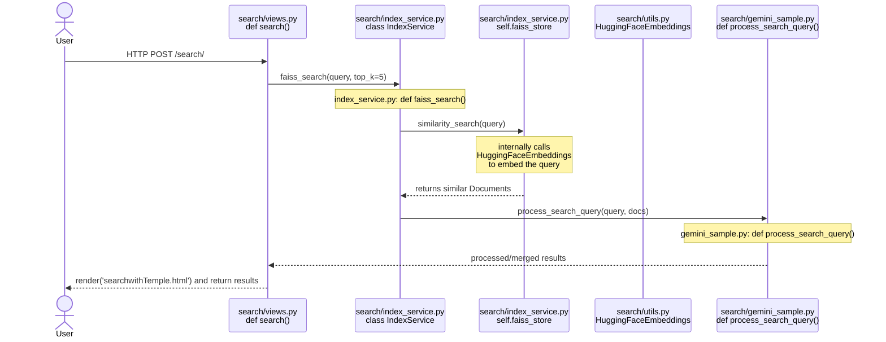

UI Design Figma Link（Dev mode）：https://www.figma.com/design/1BZN661uSi2y4FKDcd4RgZ/NextGen-AI-(Prototype)?node-id=0-1&m=dev

# Create a virtual environment
```python3 -m venv venv```

# Activate the virtual environment
```source venv/bin/activate  # macOS/Linux```

```venv\Scripts\activate     # Windows```

# Install project dependencies
```pip install -r requirements.txt```

# To setup Gemini API Key
```python set_api_key.py # enter your key``` 

then restart terminal and reactivate the virtual environment
```venv\Scripts\Activate.ps1  # Windows```

# langchain-google-genai Installation
```pip install -U langchain-google-genai```

# Install `scikit-learn` for Similarity Search
```pip install scikit-learn```

# Install Langchain community
```pip install langchain-community```

# 需要设置 Application Default Credentials (ADC)，并添加到环境变量中

# 后续数据库的数据可以被存储后，可以先按以下操作来：
1. 初始化好环境
2. 生成迁移文件：如果修改了模型（例如 RedditContent，StackOverflowContent 等），先生成迁移文件：
`python manage.py makemigrations`

3. 应用迁移：然后应用迁移到数据库：
`python manage.py migrate`
4. 检查迁移是否成功
`python manage.py showmigrations`
1. 访问 http://127.0.0.1:8000/index_content/ 接口以初始化索引。
可以通过浏览器、Postman 或 curl 发起 POST 请求：
curl -X POST http://127.0.0.1:8000/index_content/ -d "source=reddit" （命令行操作）
2. 之后就正常访问http://127.0.0.1:8000 即可输入query测试+使用RAG功能

# 如果使用bge-en-icl embedding model
1. 首先卸载当前的langchain相关包：
`pip uninstall langchain langchain-community`
2. 然后安装新的依赖：
`pip install sentence-transformers torch transformers`
`pip install langchain langchain-community`

# 测试需要install faker
`pip install faker`

# 测试
`python manage.py test_rag`

# 序列图
预览包含 Mermaid 图表的 Markdown 文档：
1. Install插件 "Markdown Preview Enhanced"
2. 使用 Ctrl+K V 打开预览


