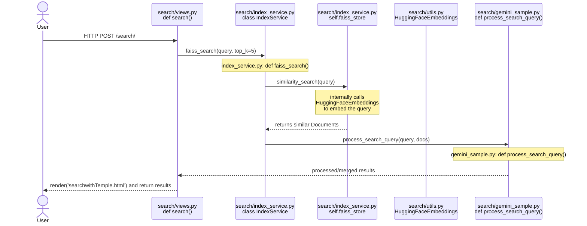

UI Design Figma Link（Dev mode）：https://www.figma.com/design/1BZN661uSi2y4FKDcd4RgZ/NextGen-AI-(Prototype)?node-id=0-1&m=dev

# 1. 环境搭建
1. Create a virtual environment

```python3 -m venv venv```

2. Activate the virtual environment

```source venv/bin/activate  # macOS/Linux```

```venv\Scripts\activate     # Windows```

3. Install project dependencies

```pip install -r requirements.txt```

# 2. To setup Gemini API Key
1.
```python set_api_key.py # enter your key``` 

2. then restart terminal and reactivate the virtual environment

```venv\Scripts\Activate.ps1  # Windows```

# 3. 额外库安装
1. langchain-google-genai Installation

```pip install -U langchain-google-genai```

2. Install `scikit-learn` for Similarity Search

```pip install scikit-learn```

3. bge-en-icl embedding model

```pip install sentence-transformers torch transformers```

4. Install Langchain community

```pip install langchain langchain-community```

# 4. 测试与数据准备
1. 安装 faker（随机生成测试数据）

```pip install faker```

2. 测试

```python manage.py test_rag```

此命令会执行：
- 清空数据库
- 生成测试数据（包括 Library A/B, Reddit 内容等）
- 构建 Embeddings 并写入数据库
- 建立 FAISS 索引
- 最后做一系列测试查询

# 5. 数据库迁移(初始化数据库）
若修改了模型结构（例如 RedditContent, StackOverflowContent 等）：
1. 生成迁移文件：

```python manage.py makemigrations```

2. 应用迁移：然后应用迁移到数据库：

```python manage.py migrate```

3. 检查迁移是否成功

```python manage.py showmigrations```

# 6. 初始化索引
1. 终端请求

可以通过浏览器、Postman 或 curl 发起 POST 请求：-> 这里是为当前数据库中reddit的数据都构建embedding和索引
`curl -X POST http://127.0.0.1:8000/index_content/ -d "source=reddit"` （目前还是用的终端输入以上POST, 后续改成postman请求）

2. 自定义管理命令 build_faiss

```python manage.py build_faiss```

# 7. 运行服务器
默认在 http://127.0.0.1:8000 提供服务
```python manage.py runserver```

# 8. 使用 RAG 进行查询
1. 在浏览器访问 http://127.0.0.1:8000, 即可打开搜索页面。
2. 输入查询语句, 如：

```Which library is recommended the most in r/study?```

3. 系统将调用后端：
- 利用 FAISS 查找相似文档；
- 结合retrieved documents进行回答；
- 最终在网页上渲染回答及相关信息。

# 9. 序列图参考
预览包含 Mermaid 图表的 Markdown 文档：
1. Install插件 "Markdown Preview Enhanced"
2. 使用 Ctrl+K V 打开预览



# 10, 可视化数据库内容
创建超级用户：
```python manage.py createsuperuser```
启动开发服务器并访问 Django Admin：
```python manage.py runserver```
```访问http://127.0.0.1:8000/admin```

# 11, 删除当前的索引库及索引 
```rm -rf faiss_index/ ```

# chromedriver下载：（爬虫时用到）
找到合适的版本下载后, 解压文件夹, 添加文件夹到：
```sudo mv chromedriver-mac-arm64.zip /usr/local/bin/```
运行test_selenium.py文件确保能够正确打印“Page title is: Google”
