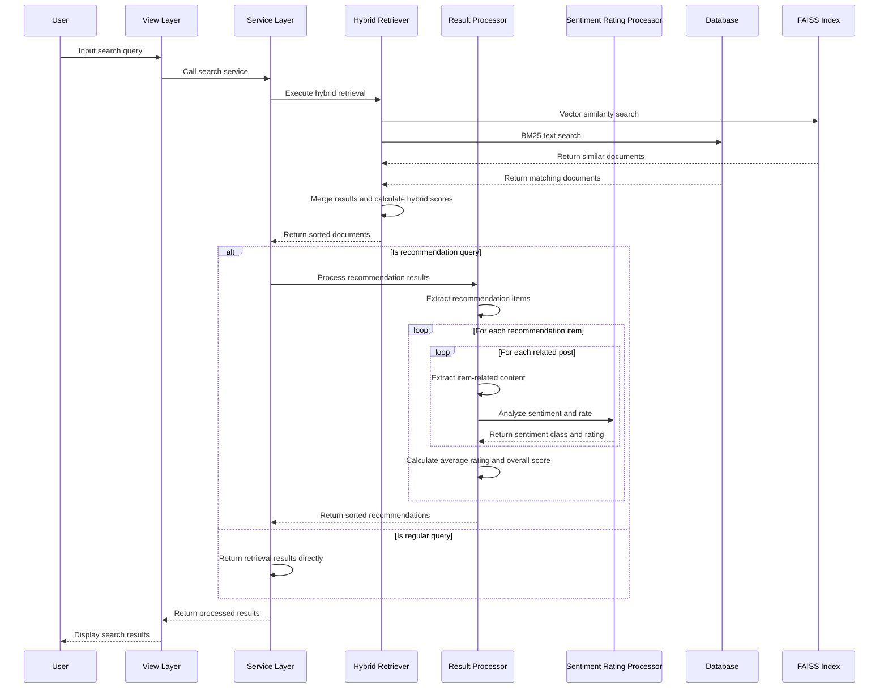

# NextGen-AI 项目

## UI 设计与流程图
- [Figma 设计链接](https://www.figma.com/design/1BZN661uSi2y4FKDcd4RgZ/NextGen-AI-(Prototype)?node-id=0-1&m=dev) (开发模式)

## 1. 环境搭建

### 1.1 创建虚拟环境
```bash
python3 -m venv venv
```

### 1.2 激活虚拟环境
```bash
# macOS/Linux
source venv/bin/activate

# Windows
venv\Scripts\activate
# 或
venv\Scripts\Activate.ps1  # PowerShell
```

### 1.3 安装项目依赖
```bash
pip install -r requirements.txt
```

## 2. 配置 Gemini API Key

```bash
python set_api_key.py  # 输入你的 API Key
```
然后重启终端并重新激活虚拟环境。

## 3. 初始化 FAISS 索引

在使用搜索功能之前，必须先初始化 FAISS 索引：

```bash
# 初始化所有平台的索引
python manage.py initialize_index --source=all

# 或者初始化特定平台的索引
python manage.py initialize_index --source=reddit
python manage.py initialize_index --source=stackoverflow
python manage.py initialize_index --source=rednote
```

初始化后，将数据库内容添加到索引中：

```bash
python manage.py index_content --source=all
```

> **注意**：每次添加新内容到数据库后，都需要运行 `index_content` 命令来更新索引。


### 3.1 索引文件结构与检索机制

 - FAISS索引系统使用两个关键文件存储数据：
    - index.faiss: 存储向量索引结构，用于快速相似性搜索
    - index.pkl: 存储文档内容和元数据(来源、ID、作者等)，与向量索引中的ID一一对应

系统使用混合检索方法提高结果相关性

### 3.2 相关性阈值与文档数量要求
- 系统仅返回相关度超过阈值(默认0.5)的文档
- RAG仅在找到至少5个高质量相关文档时激活
- 当相关文档不足时，系统回退到直接回答模式

## 4. 测试与数据准备

# 运行测试
```bash
python manage.py test_rag
```

此命令会执行：
- 生成测试数据(包括 Library A/B, Reddit 内容等)
- 构建 Embeddings 并写入数据库
- 建立 FAISS 索引
- 执行一系列测试查询

## 5. 数据库迁移

当修改模型结构时，需要进行数据库迁移：

```bash
# 1. 生成迁移文件
python manage.py makemigrations

# 2. 应用迁移到数据库
python manage.py migrate

# 3. 检查迁移状态
python manage.py showmigrations
```

## 6. 爬虫模式

爬虫系统支持两种工作模式：

### 6.1 即时索引模式
- 爬取内容的同时立即进行向量化和索引
- 索引完成后自动清除数据库中的原文内容以节省存储空间
- 适用于需要立即搜索新内容的场景

```bash
python manage.py test_rednote_crawler --url "your_url" --immediate-indexing
```

### 6.2 存储模式 (默认)
- 仅将爬取的内容存入数据库，不进行索引
- 适用于批量数据收集，稍后统一索引的场景

```bash
python manage.py test_rednote_crawler --url "your_url"
```

### 6.3 后续批量索引
   - 对存储模式下收集的内容进行批量索引
   - 支持按平台筛选进行索引
   ```bash
   # 通过 API 触发索引
   curl -X POST http://localhost:8000/index_content/ -d "source=rednote"
   ```

在post indexing指令后，有时候会出现："Skipping object with ID xx due to empty content" 类似的提醒信息
**这些消息表明什么：**

这些"skipping"消息表示系统找到了未在ContentIndex表中记录的内容条目(即认为它们未被索引)，但当尝试读取这些条目时，发现它们的content字段为空。

**为什么不同平台的行为不同：**

1. **数据一致性问题**：如果您看到某个平台(如rednote)显示跳过消息，而另一个平台(如stackoverflow)没有，这很可能是因为：
   - 该平台的内容之前已被索引过(其content字段被清空)
   - 但由于某种原因(数据库操作、迁移中断等)，ContentIndex表中相应的记录被删除了
   - 系统认为这些内容是"未索引"的，但发现内容为空时会跳过它们

2. **正常的索引行为**：这些消息通常不影响系统功能，仅表示系统在工作时正在跳过某些不完整记录

3. **跨平台一致性**：如果需要保持所有平台索引行为一致，可以：
   ```bash
   # 为所有content为空但缺少ContentIndex记录的内容创建对应记录
   python manage.py shell
   
   # 在Django shell中执行
   from django_apps.search.models import RednoteContent, ContentIndex
   
   empty_contents = RednoteContent.objects.filter(content__isnull=True)
   for item in empty_contents:
       if not ContentIndex.objects.filter(source='rednote', thread_id=item.thread_id).exists():
           ContentIndex.objects.create(
               source='rednote',
               thread_id=item.thread_id,
               content_type=item.content_type,
               author_name=item.author_name,
               created_at=item.created_at
           )
   ```

**技术背景解释：**

- 索引过程使用`thread_id`来判断内容是否已被索引，通过检查ContentIndex表
- 成功索引后，原内容的`content`字段会被设为`None`以节省存储空间
- 如果ContentIndex记录被删除但原内容记录保留(content=None)，就会出现"skipping"消息
- 不同平台可能由于数据处理过程不同而表现出不同的索引行为


### 6.4 理解索引日志和平台差异

在运行索引命令(如 `curl -X POST http://localhost:8000/index_content/ -d "source=platform"`)时，您可能会看到类似以下的日志信息：

```
Skipping object with ID xx due to empty content
```

## 7. 运行服务器

```bash
python manage.py runserver
```

服务器默认在 http://127.0.0.1:8000 提供服务。

## 8. 使用 RAG 进行查询

1. 在浏览器访问 http://127.0.0.1:8000
2. 输入查询语句，例如：`Which library is recommended the most in r/study?`
3. 系统将：
   - 利用 FAISS 查找相似文档
   - 结合检索到的文档进行回答
   - 在网页上渲染回答及相关信息

## 9. 流程图参考
#### 序列图



#### 生成序列图
预览 Mermaid 图表：
1. 安装插件 "Markdown Preview Enhanced"
2. 使用 Ctrl+K V 打开预览

#### 系统流程图


#### 生成流程图

系统流程图使用 Graphviz DOT 语言定义。要将 DOT 文件转换为图像，请使用以下命令：

```bash
# 安装 Graphviz (如果尚未安装)
# Ubuntu/Debian
sudo apt-get install graphviz

# macOS
brew install graphviz

# Windows (使用 Chocolatey)
choco install graphviz

# 生成 PNG 图像
dot -Tpng diagram.dot -o diagram.png
```

## 10. 可视化数据库内容与调试

```bash
# 创建超级用户
python manage.py createsuperuser

# 启动开发服务器
python manage.py runserver

# 以下两种可以看到更详细的日志内容
python manage.py runserver --verbosity 2
python manage.py runserver --verbosity 3
```

### 10.1 日志级别配置与调试

系统使用不同日志级别记录运行信息。要添加更详细的日志输出（特别是在调试混合检索和点赞数据时），可以在项目设置中配置日志级别：

```python
LOGGING = {
    'version': 1,
    'disable_existing_loggers': False,
    'handlers': {
        'console': {
            'class': 'logging.StreamHandler',
        },
    },
    'root': {
        'handlers': ['console'],
        'level': 'DEBUG',  # 改为DEBUG以显示更多日志
    },
    'loggers': {
        'django_apps.search': {  # 您应用的特定日志器
            'handlers': ['console'],
            'level': 'DEBUG',  # 设置为DEBUG级别
            'propagate': False,
        },
    },
}
```

**日志级别说明**：
- **DEBUG**: 显示所有级别的消息，包括最详细的调试信息，如混合检索中的各类分数、点赞数据处理等
- **INFO**: 显示一般运行信息，如已成功索引的内容数量、检索结果条数等
- **WARNING**: 只显示警告和错误，如跳过内容为空的对象时的警告
- **ERROR**: 只显示错误信息，如索引初始化失败

在排查点赞数据正确性、混合检索评分、BM25搜索结果时，推荐使用DEBUG级别。

访问 Django Admin：http://127.0.0.1:8000/admin

## 11. 管理索引

删除当前的索引库：
```bash
rm -rf faiss_index/
```

## 12. 爬虫配置

### ChromeDriver 下载
找到合适的版本下载后，解压并添加到系统路径：
```bash
sudo mv chromedriver-mac-arm64.zip /usr/local/bin/
```

运行 `test_selenium.py` 文件确保能够正确打印 "Page title is: Google"

## 13. 配置参数

- `SEARCH_DEFAULT_TOP_K = 10`
- `SEARCH_TEST_TOP_K = 5`

## 14. 项目启动步骤

### 后端
```bash
python manage.py runserver
```

### 前端
```bash
cd Frontend
npm run dev
```

# 15. 将本地数据（sqlite + faiss相关）push到github上 以及数据获取

## 将本地数据（sqlite + faiss相关）push到github上

## 安装Git LFS (需要添加到README中)
brew install git-lfs  # macOS
which git-lfs
git-lfs install

## 设置Git LFS
git lfs install

## 跟踪SQLite数据库文件
git lfs track "*.sqlite3"
git lfs track "*.db"

## 跟踪FAISS索引文件
git lfs track "*.faiss"
git lfs track "*.pkl"

## 检查哪些文件已被Git LFS跟踪
git lfs ls-files


## 数据文件：
本项目包含以下预构建的数据文件以便快速开始测试：

- **SQLite数据库** (`db.sqlite3`): 包含已爬取和处理的内容数据
- **FAISS索引目录** (`faiss_index/`): 包含各平台的预构建向量索引
  - `faiss_index/reddit/`: Reddit数据索引
  - `faiss_index/stackoverflow/`: StackOverflow数据索引
  - `faiss_index/rednote/`: Rednote数据索引

### 获取数据文件：
通过Git LFS管理。克隆项目后，运行以下命令获取数据文件

安装Git LFS (如果尚未安装)
macOS: brew install git-lfs
Ubuntu: sudo apt-get install git-lfs
Windows: choco install git-lfs
初始化Git LFS
git lfs install
拉取LFS文件
git lfs pull

### 数据文件提交：
# 1. 先提交.gitattributes文件和README修改
git add .gitignore .gitattributes README.md
git commit -m "Add Git LFS configuration and update README"

# 2. 然后添加数据库和索引文件
git add db.sqlite3 faiss_index/
# 此时Git LFS应该会显示跟踪信息，如：
# "Tracking db.sqlite3"
# "Tracking faiss_index/reddit/index.faiss"

# 3. 提交大文件
git commit -m "Add SQLite database and FAISS indexes via Git LFS"

# 4. 推送到GitHub
git push origin main  # 或您使用的分支名

使用前端服务器提供的 URL：http://localhost:5173/static/ 访问